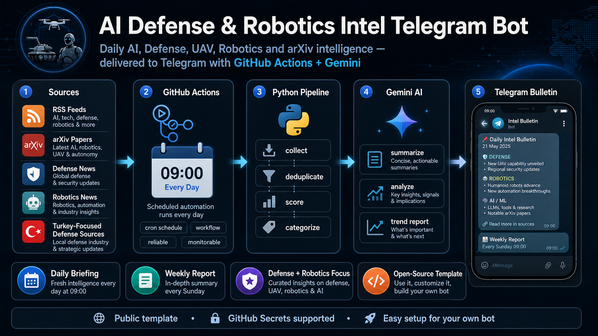
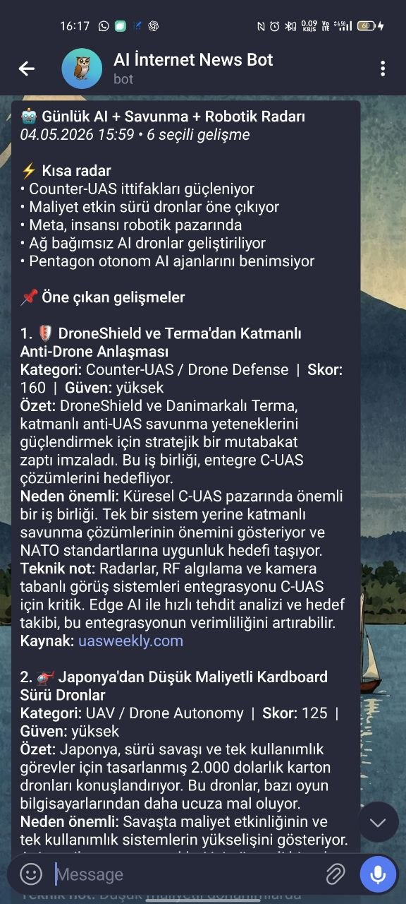
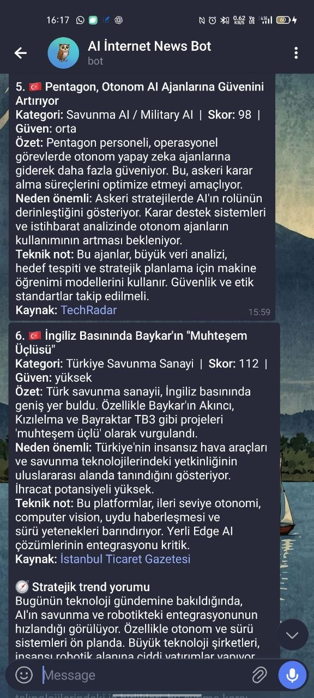

<div align="center">

# AI Defense & Robotics Intel Telegram Bot

**Daily AI, Defense, UAV, Robotics and arXiv intelligence — delivered to Telegram with GitHub Actions + Gemini**



[](#)
[](#)
[](#)
[](#)
[](LICENSE)

</div>

---

## 🇹🇷 Türkçe

### Proje Hakkında

**AI Defense & Robotics Intel Telegram Bot**, yapay zeka, savunma sanayi, İHA/UAV, robotik, edge AI, computer vision ve arXiv makalelerini takip eden açık kaynaklı bir Telegram haber/istihbarat bülteni botudur.

Bot her gün belirlenen saatte kaynakları tarar, haberleri toplar, tekrar eden içerikleri temizler, önem skoruna göre sıralar, Gemini ile Türkçe özet ve analiz üretir, ardından sonucu Telegram üzerinden gönderir.

Bu proje özellikle şu alanlarla ilgilenen kullanıcılar için tasarlanmıştır:

- Yapay zeka ve büyük dil modelleri
- Savunma sanayi teknolojileri
- İHA, SİHA, UAV ve counter-UAS sistemleri
- Robotik ve humanoid robotlar
- Edge AI ve gömülü yapay zeka
- Computer vision, YOLO ve nesne takibi
- Otonom sistemler ve sürü robotik
- arXiv araştırma makaleleri
- Türkiye odaklı savunma sanayi gelişmeleri

---

### Özellikler

- Her gün otomatik Telegram bülteni gönderir.
- Haftalık derin trend raporu oluşturur.
- RSS, Google News RSS ve arXiv kaynaklarından veri toplar.
- Haberleri kategoriye ayırır.
- Benzer haberleri tekilleştirir.
- Gemini ile kısa, okunabilir ve teknik özetler üretir.
- Savunma, robotik ve UAV odaklı önem skoru hesaplar.
- GitHub Actions ile ücretsiz zamanlama sağlar.
- API anahtarları GitHub Secrets ile güvenli şekilde saklanır.
- Public/template repository olarak paylaşılmaya uygundur.

---

### Sistem Mimarisi

```text
Sources / RSS / arXiv / Google News
        ↓
GitHub Actions Scheduler
        ↓
Python Collector Pipeline
        ↓
Deduplication + Scoring + Categorization
        ↓
Gemini AI Summary and Analysis
        ↓
Telegram Daily Bulletin
```

---

### Telegram Çıktısı Örneği

Bu alana kendi Telegram ekran görüntülerini ekleyebilirsin:






Örnek mesaj yapısı:

```text
🤖 Günlük AI + Savunma + Robotik Radarı
04.05.2026 09:00 • 6 seçili gelişme

⚡ Kısa radar
• Counter-UAS tarafında sensör füzyonu öne çıkıyor.
• Edge AI, ağ bağımsız İHA sistemlerinde kritik hale geliyor.
• Robotik tarafında embodied AI yatırımları hızlanıyor.

📌 Öne çıkan gelişmeler

1. 🛡️ DroneShield ve Terma’dan Counter-UAS iş birliği
Kategori: Counter-UAS / Drone Defense | Skor: 92.5 | Güven: yüksek
Özet: ...
Neden önemli: ...
Teknik not: ...
Kaynak: ...
```

---

### Kurulum

#### 1. Repoyu Kullan

Bu repoyu iki şekilde kullanabilirsin:

1. **Use this template** butonuna tıklayarak kendi repository’ni oluştur.
2. veya repoyu fork’la.

#### 2. Telegram Bot Token Al

Telegram’da `@BotFather` hesabını aç ve şu komutu gönder:

```text
/newbot
```

Bot adını ve kullanıcı adını belirledikten sonra BotFather sana bir token verir.

Bu token şu secret olarak eklenecek:

```text
TELEGRAM_BOT_TOKEN
```

#### 3. Telegram Chat ID Al

Önce kendi botuna Telegram’dan bir mesaj gönder.

Sonra tarayıcıda şu URL’yi aç:

```text
https://api.telegram.org/botTELEGRAM_BOT_TOKEN/getUpdates
```

Dönen JSON içinde şu alanı bul:

```json
"chat": {
  "id": 123456789
}
```

Bu sayı senin chat id değerindir.

GitHub Secrets’a şu adla eklenecek:

```text
TELEGRAM_CHAT_ID
```

#### 4. Gemini API Key Al

Google AI Studio üzerinden Gemini API key oluştur.

Bu değer GitHub Secrets’a şu adla eklenecek:

```text
GEMINI_API_KEY
```

#### 5. GitHub Secrets Ekle

Repository içinde şu bölüme git:

```text
Settings → Secrets and variables → Actions → New repository secret
```

Aşağıdaki secret’ları ekle:

```text
GEMINI_API_KEY
TELEGRAM_BOT_TOKEN
TELEGRAM_CHAT_ID
```

#### 6. Workflow’u Test Et

GitHub’da:

```text
Actions → Daily AI Defense Robotics Intel Bulletin → Run workflow
```

Manuel çalıştırma başarılı olursa Telegram’a günlük bülten gelir.

---

### Zamanlama

Varsayılan günlük bülten Türkiye saatiyle her sabah **09:00** için ayarlanmıştır.

GitHub Actions UTC kullandığı için workflow içinde cron değeri şu şekildedir:

```yaml
cron: "0 6 * * *"
```

Bu değer:

```text
06:00 UTC = 09:00 Türkiye saati
```

Haftalık rapor varsayılan olarak pazar günü Türkiye saatiyle 17:00’de çalışacak şekilde ayarlanabilir:

```yaml
cron: "0 14 * * 0"
```

---

### Dosya Yapısı

```text
.
├── main.py
├── sources.json
├── requirements.txt
├── .env.example
├── .gitignore
├── README.md
├── LICENSE
├── SECURITY.md
├── CONTRIBUTING.md
├── CHANGELOG.md
├── assets/
│   ├── ai_intel_bot_banner.png
│   ├── telegram_daily_output.png
│   └── telegram_weekly_output.png
└── .github/
    ├── workflows/
    │   ├── daily-ai-intel.yml
    │   └── weekly-ai-intel.yml
    └── ISSUE_TEMPLATE/
        ├── bug_report.md
        └── feature_request.md
```

---

### Kaynakları Özelleştirme

Kaynaklar `sources.json` dosyasından yönetilir. Yeni RSS kaynağı, arXiv sorgusu veya haber araması eklemek için bu dosyayı düzenleyebilirsin.

Örnek:

```json
{
  "name": "Robotics News",
  "url": "https://example.com/feed.xml",
  "category": "robotics",
  "weight": 1.2
}
```

Önerilen kategoriler:

```text
general_ai
defense_ai
robotics
uav
counter_uas
edge_ai
computer_vision
arxiv
turkey_defense
```

---

### Güvenlik Notu

API key, Telegram token veya `.env` dosyasını kesinlikle repoya yükleme.

Doğru kullanım:

```text
GitHub Secrets → güvenli
.env.example → public repoda kalabilir
.env → public repoya yüklenmemeli
```

`.gitignore` içinde `.env` dosyasının hariç tutulduğundan emin ol.

---

### Katkı Sağlama

Katkılar memnuniyetle kabul edilir.

Katkı fikirleri:

- Yeni haber kaynakları ekleme
- Daha iyi skor algoritması
- Daha temiz Telegram mesaj formatı
- Yeni kategori destekleri
- Google Sheets arşivleme
- Çoklu dil desteği
- Web dashboard
- Telegram komutları: `/bugun`, `/haftalik`, `/robotik`, `/savunma`

Detaylar için `CONTRIBUTING.md` dosyasına bakabilirsin.

---

### Yol Haritası

- [x] Günlük Telegram bülteni
- [x] GitHub Actions zamanlama
- [x] Gemini ile haber özeti
- [x] Savunma + robotik odaklı kaynaklar
- [x] arXiv araştırma taraması
- [x] HTML formatlı Telegram mesajı
- [ ] Google Sheets arşivi
- [ ] Telegram komut desteği
- [ ] Çok kullanıcılı yapı
- [ ] Web dashboard
- [ ] Gelişmiş trend grafikleri

---

### Lisans

Bu proje MIT lisansı ile yayınlanmıştır. Detaylar için `LICENSE` dosyasına bakabilirsin.

---

## 🇬🇧 English

### About the Project

**AI Defense & Robotics Intel Telegram Bot** is an open-source Telegram intelligence bulletin bot that monitors AI, defense technology, UAVs, robotics, edge AI, computer vision, and arXiv research papers.

The bot runs automatically on a schedule, collects relevant sources, removes duplicate items, ranks stories by relevance, generates concise summaries and analysis using Gemini, and delivers the result directly to Telegram.

This project is designed for people interested in:

- Artificial intelligence and large language models
- Defense technology and military AI
- UAVs, drones, and counter-UAS systems
- Robotics and humanoid robots
- Edge AI and embedded intelligence
- Computer vision, YOLO, and object tracking
- Autonomous systems and swarm robotics
- arXiv research papers
- Turkey-focused defense industry updates

---

### Features

- Sends an automated daily Telegram bulletin.
- Generates a weekly deep trend report.
- Collects data from RSS feeds, Google News RSS, and arXiv.
- Categorizes news items by topic.
- Removes duplicate and near-duplicate items.
- Uses Gemini to generate concise and readable technical summaries.
- Scores items based on defense, robotics, UAV, and AI relevance.
- Runs for free with GitHub Actions scheduling.
- Keeps credentials secure with GitHub Secrets.
- Works well as a public/template repository.

---

### Architecture

```text
Sources / RSS / arXiv / Google News
        ↓
GitHub Actions Scheduler
        ↓
Python Collector Pipeline
        ↓
Deduplication + Scoring + Categorization
        ↓
Gemini AI Summary and Analysis
        ↓
Telegram Daily Bulletin
```

---

### Telegram Output Example

You can add your own Telegram screenshots here:

```md


```

Example structure:

```text
🤖 Daily AI + Defense + Robotics Radar
04.05.2026 09:00 • 6 selected signals

⚡ Quick radar
• Sensor fusion is becoming critical in counter-UAS systems.
• Edge AI is a key enabler for network-independent UAVs.
• Embodied AI investments are accelerating in robotics.

📌 Top developments

1. 🛡️ DroneShield and Terma announce Counter-UAS partnership
Category: Counter-UAS / Drone Defense | Score: 92.5 | Confidence: high
Summary: ...
Why it matters: ...
Technical note: ...
Source: ...
```

---

### Installation

#### 1. Use This Repository

You can use this project in two ways:

1. Click **Use this template** and create your own repository.
2. Or fork this repository.

#### 2. Create a Telegram Bot Token

Open `@BotFather` on Telegram and send:

```text
/newbot
```

After choosing a bot name and username, BotFather will provide a token.

Add this token as a GitHub secret:

```text
TELEGRAM_BOT_TOKEN
```

#### 3. Get Your Telegram Chat ID

First, send a message to your Telegram bot.

Then open this URL in your browser:

```text
https://api.telegram.org/botTELEGRAM_BOT_TOKEN/getUpdates
```

Find the following field in the returned JSON:

```json
"chat": {
  "id": 123456789
}
```

This value is your chat id.

Add it as a GitHub secret:

```text
TELEGRAM_CHAT_ID
```

#### 4. Get a Gemini API Key

Create a Gemini API key from Google AI Studio.

Add it as a GitHub secret:

```text
GEMINI_API_KEY
```

#### 5. Add GitHub Secrets

Go to your repository:

```text
Settings → Secrets and variables → Actions → New repository secret
```

Add the following secrets:

```text
GEMINI_API_KEY
TELEGRAM_BOT_TOKEN
TELEGRAM_CHAT_ID
```

#### 6. Test the Workflow

Go to:

```text
Actions → Daily AI Defense Robotics Intel Bulletin → Run workflow
```

If the test succeeds, you should receive the daily bulletin on Telegram.

---

### Scheduling

The default daily bulletin is scheduled for **09:00 Turkey time**.

GitHub Actions uses UTC, so the workflow uses:

```yaml
cron: "0 6 * * *"
```

This means:

```text
06:00 UTC = 09:00 Turkey time
```

The weekly report can be scheduled for Sunday at 17:00 Turkey time:

```yaml
cron: "0 14 * * 0"
```

---

### Project Structure

```text
.
├── main.py
├── sources.json
├── requirements.txt
├── .env.example
├── .gitignore
├── README.md
├── LICENSE
├── SECURITY.md
├── CONTRIBUTING.md
├── CHANGELOG.md
├── assets/
│   ├── ai_intel_bot_banner.png
│   ├── telegram_daily_output.png
│   └── telegram_weekly_output.png
└── .github/
    ├── workflows/
    │   ├── daily-ai-intel.yml
    │   └── weekly-ai-intel.yml
    └── ISSUE_TEMPLATE/
        ├── bug_report.md
        └── feature_request.md
```

---

### Customizing Sources

Sources are managed in `sources.json`. You can add new RSS feeds, arXiv queries, or search-based sources by editing that file.

Example:

```json
{
  "name": "Robotics News",
  "url": "https://example.com/feed.xml",
  "category": "robotics",
  "weight": 1.2
}
```

Suggested categories:

```text
general_ai
defense_ai
robotics
uav
counter_uas
edge_ai
computer_vision
arxiv
turkey_defense
```

---

### Security Notice

Never commit your API keys, Telegram bot token, or `.env` file to the repository.

Correct usage:

```text
GitHub Secrets → safe
.env.example → safe for public repositories
.env → must not be committed
```

Make sure `.env` is included in `.gitignore`.

---

### Contributing

Contributions are welcome.

Possible contribution ideas:

- Add new trusted sources
- Improve the ranking algorithm
- Improve Telegram message formatting
- Add new categories
- Add Google Sheets archiving
- Add multilingual support
- Build a web dashboard
- Add Telegram commands: `/today`, `/weekly`, `/robotics`, `/defense`

See `CONTRIBUTING.md` for details.

---

### Roadmap

- [x] Daily Telegram bulletin
- [x] GitHub Actions scheduling
- [x] Gemini-powered news summary
- [x] Defense + robotics focused sources
- [x] arXiv research scanning
- [x] HTML-formatted Telegram messages
- [ ] Google Sheets archive
- [ ] Telegram command support
- [ ] Multi-user mode
- [ ] Web dashboard
- [ ] Advanced trend charts

---

### License

This project is released under the MIT License. See the `LICENSE` file for details.

---

<div align="center">

**Build your own AI, defense and robotics intelligence assistant — powered by GitHub Actions, Gemini and Telegram.**

</div>
